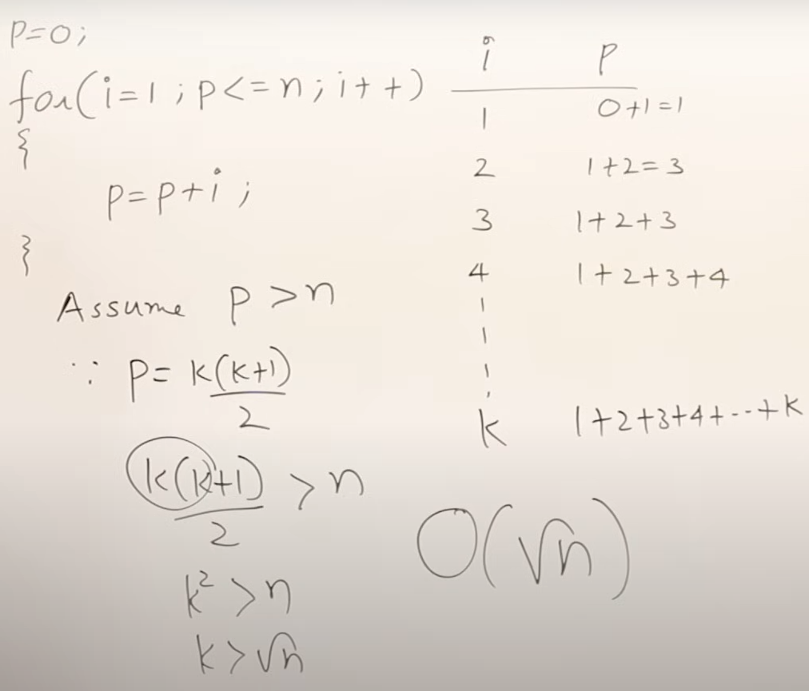
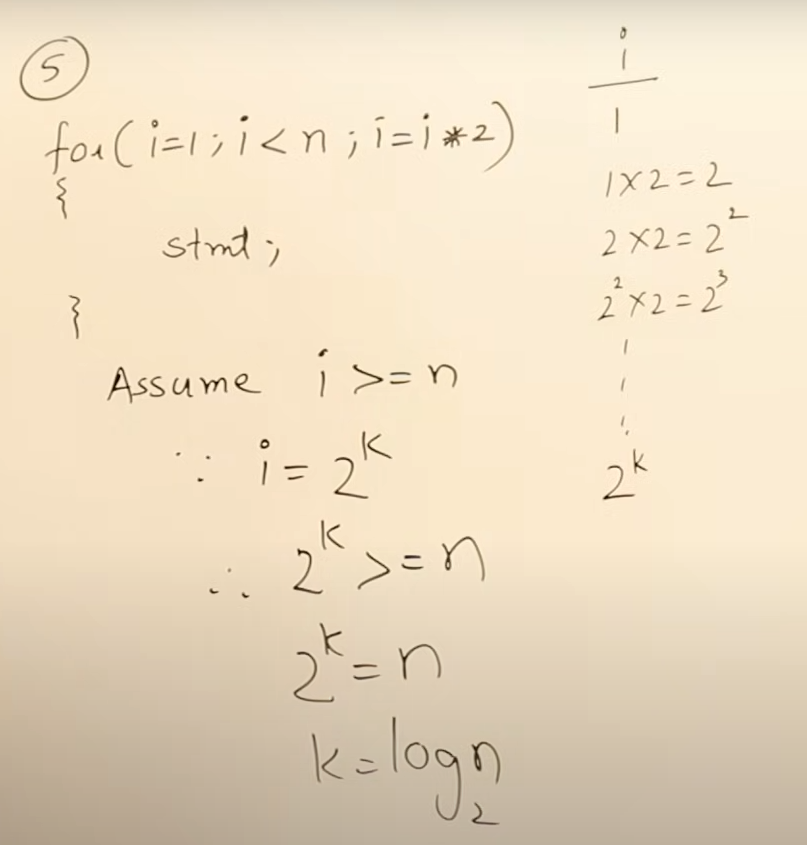
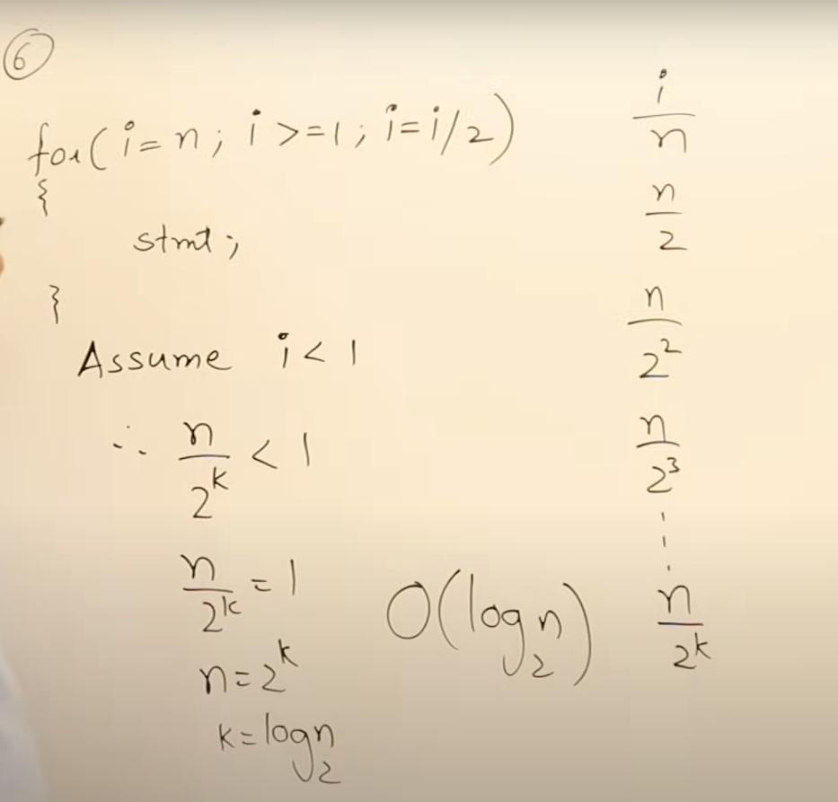
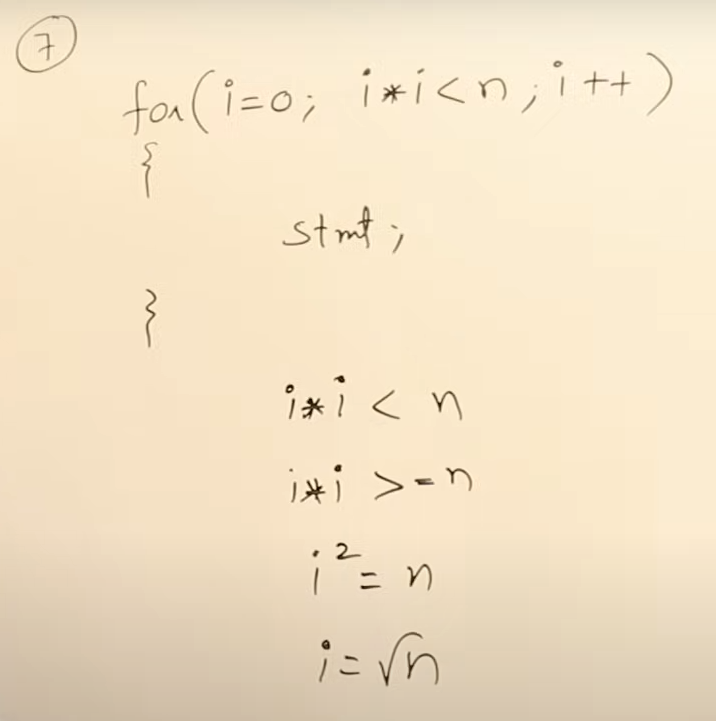
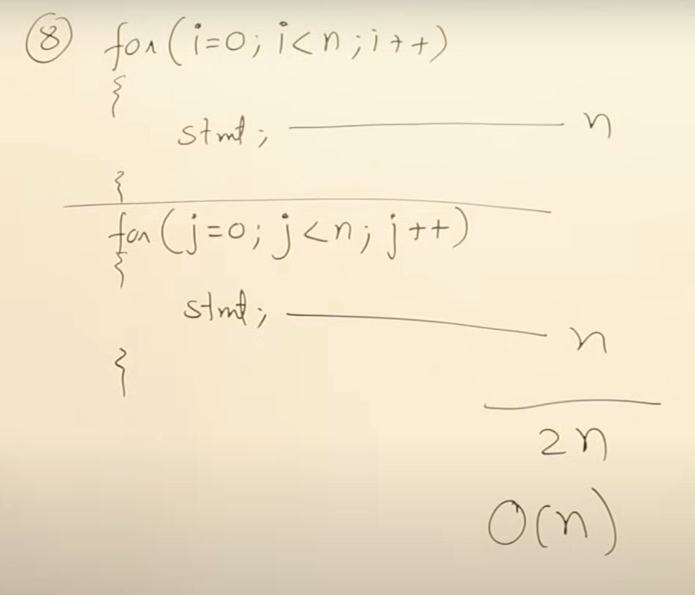
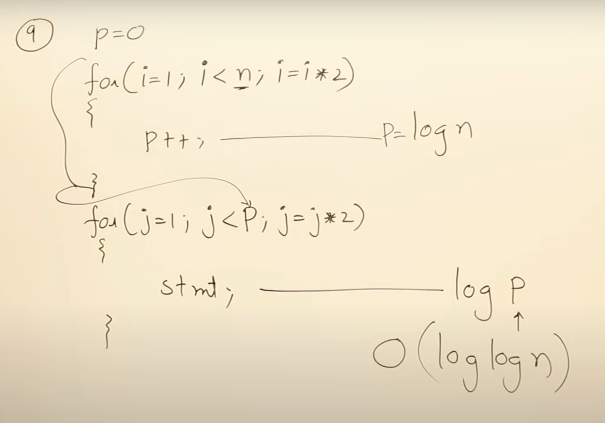
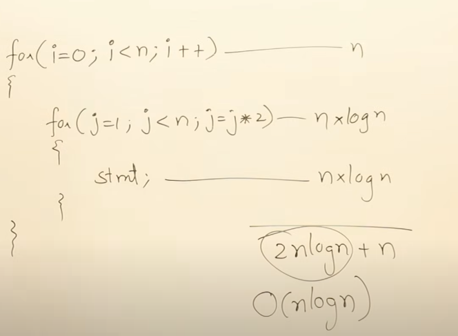
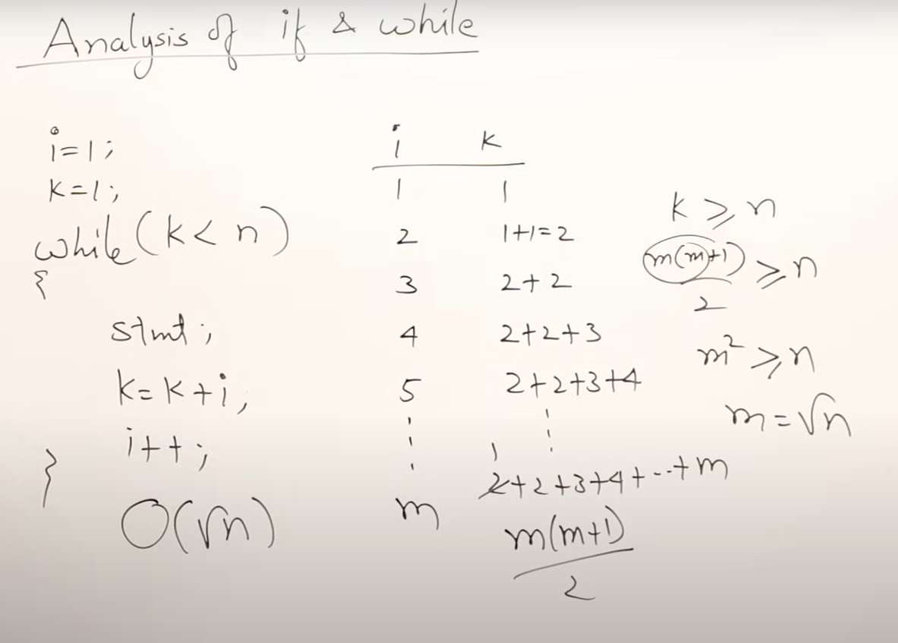
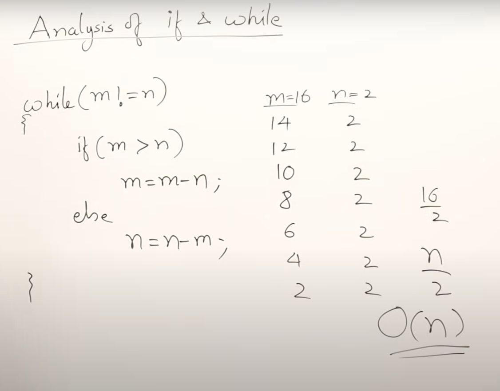

#### Characteristics of Algorithm

1.  Input: Algorithm should have at least 0 or more input.
2.  Output: Algorithm may have at least one output
3.  Definiteness: Every statement must be unambiguous and have single exact meaning.
4.  Finiteness: Every algorithm should stop at some point.
5.  Effectiveness: Every statement must contribute something to the objective of the algorithm

#### Time Complexity Examples

```
for(i = 0; i < n; i++) {
    statement;
}
```

```
for(i = n; i > 0; i--) {
    statement;
}
```

In both the cases, the loop will run till `n` times so the time complexity is `O(n)`.

```
for(i = 0; i < n; i++) {
    for(j = 0; j < n; j++) {
        statement;
    }
}
```

The inner loop will run `n` times for each iteration of i which will run `n` times. So total time taken is `n*n` and time complexity is **`O(n<sup>2</sup>)`**.

```
for(i = 0; i < n; i++) {
    for(j = 0; j < i; j++) {
        statement;
    }
}
```

| i   | j   | n   |
| --- | --- | --- |
| 0   | 0(x) | 0   |
| 1   | 0   | 1   |
|     | 1(x) |     |
| 2   | 0   | 3   |
|     | 1   |     |
|     | 2(x) |     |

`x` -> Not Executed

Here, for every i, j executes till i. So the total run time is `1 + 2 + 3 + ... + n` which is `(n(n+1))/2` which is **(`n<sup>2</sup>`+1)/2** so the time complexity is **`O(n<sup>2</sup>)`**.



Here, time complexity is `O($\sqrt{k}$)` because the loop is not executed while `i<n` but `p<n`.

Square root time complexity, means that the algorithm's running time grows proportionally to the square root of the input size (n). This is a relatively efficient algorithm, as its growth rate is slower than linear (O(n)) but faster than logarithmic (O(log n)).



In the loop, we are doubling the i value by 2. The value keeps increasing as 2<sup>1</sup>, 2<sup>2</sup>, 2<sup>3</sup>, till 2<sup>k</sup>.

Since the loop stops at i >= n, i is equal to 2<sup>k</sup> and 2<sup>k</sup> is >= n. Using that, we can derive the runtime as `O(log n)`.



In the loop, we are dividing the i value by 2. The value keeps decreasing as n / 2, n / (2<sup>2</sup>), n / (2<sup>3</sup>) till n / (2<sup>k</sup>).

Since the loop stops at i >= 1, i < n / 2<sup>k</sup> and n / 2<sup>k</sup> is = 1. Using that, we can derive the runtime as `O(log n)`.

In simple terms, if the value is increasing or decreasing by half, we can consider the run time as log n.



Time complexity is `O($\sqrt{n}$)`.



Time Complexity is `O(n)` since there is no nesting.



First loop has time complexity of log n. The second loop is executed log of P times which is log n so time complexity of second loop is `O(log log n)` .

```
log₂(n) = how many times you divide n by 2 until you get 1  
log₂(log₂(n)) = how many times you divide log₂(n) by 2 until you get 1

```



Time Complexity is `O(n logn)` .


In code, we are multiplying `a` by `2` until `a` < `b`. The loop will terminate when `a` >= `b`. Since `a` >= `b`, we can consider `a` = `b`. We can assume that `a` was multiplied by 2 `k` times. Using the substition in the image, we can deduce that `2<sup>k</sup>` = b and `k` = `log<sub>2</sub>b`. Hence the run time is `O(log n)`.



In the above code, if we generate values for i and k till m value, k is executed till `(m(m+1))/2`. Using substitution, we get complexity as `O($\sqrt{n}$)`.



If we assume `m` and `n` as `6` and `3`, loop will execute once since `m` will be decremented by `n`, so value of `m` will become `6-3=3` and both `m` and `n` will be equal and program will stop.

If we assume `m` and `n` as `5` and `5`, then loop won't be executed.

If we assume `m` as `16` and `n` as `2`, then the progam will execute for `n/2` times. So in worst case, the time complexity will be `O(n)`.