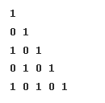

#### Steps to print any pattern

1. For the outer loop, count the number of rows (lines).
2. For the inner loop, focus on the columns(character to print) and somehow relate the column to the row.
3. Print the character inside the inner loop.
4. Observe symmetry. (This step is optional).

#### Patterns
1.


For each row in the above pattern, we are simply printing `*` 4 times. So we are running two nested loops and printing the characters in the loop.

Code:
```c++
#include <bits/stdc++.h>

using namespace std;
void print_pattern_1(int n)

{
    for (int i = 0; i < n; i++)
    {
        for (int j = 0; j < n; j++)
        {
            cout << "*";
        }
        cout << endl;
    }
}

int main()
{
    int n = 4;
    print_pattern_1(n);
    return 0;
}
```

2.

```c++
#include <bits/stdc++.h>

using namespace std;
void print_pattern_2(int n)
{
    for (int i = 0; i < n; i++)
    {
        for (int j = 0; j <= i; j++)
        {
            cout << "*";
        }
        cout << endl;
    }
}

int main()
{
    print_pattern_2(5);
    return 0;
}
```

3.

```c++
#include <bits/stdc++.h>

using namespace std;
void print_pattern_3(int n)
{
    for (int i = 1; i <= n; i++)
    {
        for (int j = 1; j <= i; j++)
        {
            cout << j;
        }
        cout << endl;
    }
}

int main()
{
    print_pattern_3(5);
    return 0;
}
```

4.

```c++
#include <bits/stdc++.h>

using namespace std;
void print_pattern_4(int n)
{
    for (int i = 1; i <= n; i++)
    {
        for (int j = 1; j <= i; j++)
        {
            cout << i;
        }
        cout << endl;
    }
}

int main()
{
    print_pattern_4(5);
    return 0;
}
```

5.

```c++
#include <bits/stdc++.h>

using namespace std;
void print_pattern_5(int n)
{
    // My solution, also returns the same result but doesn't follow the 4 steps.
    // for (int i = n; i > 0; i--)
    // {
    //     for (int j = i; j > 0; j--)
    //     {
    //         cout << "*";
    //     }
    //     cout << endl;
    // }

    for (int i = 1; i <= n; i++)
    {
        for (int j = 1; j <= n - i + 1; j++)
        {
            cout << "*";
        }
        cout << endl;
    }
}

int main()
{
    print_pattern_5(5);
    return 0;
}

```

6.

```c++
#include <bits/stdc++.h>

using namespace std;
void print_pattern_6(int n)
{
    // My solution, also returns the same result but doesn't follow the 4 steps.
    // for (int i = n; i > 0; i--)
    // {
    //     for (int j = 1; j <= i; j++)
    //     {
    //         cout << j;
    //     }
    //     cout << endl;
    // }

    for (int i = 1; i <= n; i++)
    {
        for (int j = 1; j <= n - i + 1; j++)
        {
            cout << j;
        }
        cout << endl;
    }
}

int main()
{
    print_pattern_6(5);
    return 0;
}
```

7.

```c++

#include <bits/stdc++.h>

using namespace std;
void print_pattern_7(int n)
{
    // My Solution
    // int total_columns{n * 2 - 1};
    // for (int i = 1; i <= n; i++)
    // {
    //     int total_space{(total_columns - (((i - 1) * 2) + 1)) / 2};
    //     for (int j = 0; j < total_space; j++)
    //         cout << " ";
    //     for (int j = 0; j < i * 2 - 1; j++)
    //         cout << "*";
    //     for (int j = 0; j < total_space; j++)
    //         cout << " ";
    //     cout << endl;
    // }

    for (int i = 0; i < n; i++)
    {
        for (int j = 0; j < n - i - 1; j++)
        {
            cout << " ";
        }
        for (int j = 0; j < i * 2 + 1; j++)
        {
            cout << "*";
        }
        for (int j = 0; j < n - i - 1; j++)
        {
            cout << " ";
        }
        cout << endl;
    }
}

int main()
{
    print_pattern_7(5);
    return 0;
}
```

8.

```c++
#include <bits/stdc++.h>

using namespace std;
void print_pattern_8(int n)
{
    // My solution, also returns the same result but doesn't follow the 4 steps.
    // for (int i = n - 1; i >= 0; i--)
    // {
    //     for (int j = 0; j < n - i - 1; j++)
    //     {
    //         cout << " ";
    //     }
    //     for (int j = 0; j < i * 2 + 1; j++)
    //     {
    //         cout << "*";
    //     }
    //     for (int j = 0; j < n - i - 1; j++)
    //     {
    //         cout << " ";
    //     }
    //     cout << endl;
    // }

    for (int i = 0; i < n; i++)
    {
        for (int j = 0; j < i; j++)
        {
            cout << " ";
        }
        for (int j = 0; j < n * 2 - (i * 2 + 1); j++)
        {
            cout << "*";
        }
        for (int j = 0; j < i; j++)
        {
            cout << " ";
        }
        cout << endl;
    }
}

int main()
{
    print_pattern_8(5);
    return 0;
}
```

9.


```c++
#include <bits/stdc++.h>

using namespace std;
void print_pattern_9(int n)
{
    for (int i = 0; i < n; i++)
    {
        for (int j = 0; j < n - i - 1; j++)
        {
            cout << " ";
        }
        for (int j = 0; j < i * 2 + 1; j++)
        {
            cout << "*";
        }
        for (int j = 0; j < n - i - 1; j++)
        {
            cout << " ";
        }
        cout << endl;
    }
    for (int i = 0; i < n; i++)
    {
        for (int j = 0; j < i; j++)
        {
            cout << " ";
        }
        for (int j = 0; j < n * 2 - (i * 2 + 1); j++)
        {
            cout << "*";
        }
        for (int j = 0; j < i; j++)
        {
            cout << " ";
        }
        cout << endl;
    }
}

int main()
{
    print_pattern_9(5);
    return 0;
}
```

10.

```c++
#include <bits/stdc++.h>

using namespace std;
void print_pattern_10(int n)
{

    int total_lines{2 * n - 1};
    for (int i = 1; i <= total_lines; i++)
    {
        int stars = i > n ? total_lines - i + 1 : i;
        for (int j = 1; j <= stars; j++)
        {
            cout << "*";
        }
        cout << endl;
    }
}

int main()
{
    print_pattern_10(5);
    return 0;
}
```

11.


```c++
#include <bits/stdc++.h>

using namespace std;
void print_pattern_11(int n)
{
    for (int i = 1; i <= n; i++)
    {
        int start = i % 2 == 0 ? 0 : 1;
        for (int j = 0; j < i; j++)
        {
            cout << start << " ";
            start = 1 - start;
        }
        cout << endl;
    }
}

int main()
{
    print_pattern_11(5);
    return 0;
}
```

12.

```c++
#include <bits/stdc++.h>

using namespace std;
void print_pattern_12(int n)
{
    for (int i = 1; i <= n; i++)
    {
        for (int j = 1; j <= i; j++)
        {
            cout << j;
        }
        for (int j = 1; j <= 2 * (n - i); j++)
        {
            cout << " ";
        }
        for (int j = i; j >= 1; j--)
        {
            cout << j;
        }
        cout << endl;
    }
}

int main()
{
    print_pattern_12(4);
    return 0;
}
```

13.

```c++
#include <bits/stdc++.h>

using namespace std;
void print_pattern_13(int n)
{
    int value = 1;
    for (int i = 1; i <= n; i++)
    {
        for (int j = 1; j <= i; j++)
        {
            cout << value++ << " ";
        }
        cout << endl;
    }
}

int main()
{
    print_pattern_13(5);
    return 0;
}
```

14.

```c++
#include <bits/stdc++.h>

using namespace std;
void print_pattern_14(int n)
{
    for (int = 1; i <= n; i++)
    {
        for (char j = 'A'; j < 'A' + i; j++)
        {
            cout << j;
        }
        cout << endl;
    }
}

int main()
{
    print_pattern_14(5);
    return 0;
}
```

15.

```c++
#include <bits/stdc++.h>

using namespace std;
void print_pattern_15(int n)
{
    for (int = 1; i <= n; i++)
    {
        for (char j = 'A'; j < 'A' + (n + 1 - i); j++)
        {
            cout << j;
        }
        cout << endl;
    }
}

int main()
{
    print_pattern_15(5);
    return 0;
}
```

16.


```c++
#include <bits/stdc++.h>

using namespace std;
void print_pattern_16(int n)
{
    for (int i = 1; i <= n; i++)
    {
        char ch = 'A' + i - 1;
        for (int j = 1; j <= i; j++)
        {
            cout << ch;
        }
        cout << endl;
    }
}

int main()
{
    print_pattern_16(5);
    return 0;
}
```

17.

```c++
#include <bits/stdc++.h>

using namespace std;

void print_pattern_17(int n)
{
    for (int i = 1; i <= n; i++)
    {
        for (int j = 1; j <= n - i; j++)
        {
            cout << " ";
        }

        // My Solution
        // for (char j = 'A'; j < 'A' + i; j++)
        // {
        //     cout << j;
        // }

        // for (char j = 'A' + i - 2; j >= 'A'; j--)
        // {
        //     cout << j;
        // }

        char ch = 'A';
        int total_characters = i * 2 - 1;
        for (int j = 1; j <= total_characters; j++)
        {
            cout << ch;
            if (j <= total_characters / 2)
            {
                ch++;
            }
            else
            {
                ch--;
            }
        }

        for (int j = 1; j <= n - i; j++)
        {
            cout << " ";
        }
        cout << endl;
    }
}

int main()
{
    print_pattern_17(4);
    return 0;
}
```

18.

```c++
#include <bits/stdc++.h>

using namespace std;
void print_pattern_18(int n)
{
    for (int i = 1; i <= n; i++)
    {
        // My Solution
        // char ch = 'A' + n - i;
        // for (int j = 1; j <= i; j++)
        // {
        //     cout << ch << " ";
        //     ch++;
        // }

        for(char j = 'A' + n - i; j <= 'A' + n - 1; j++) {
            cout << j << " ";
        }
        cout << endl;
    }
}

int main()
{
    print_pattern_18(5);
    return 0;
}
```

19.

```c++
#include <bits/stdc++.h>

using namespace std;

void print_pattern_19(int n)
{
    for (int i = 0; i < n; i++)
    {
        for (int j = n - i; j > 0; j--)
        {
            cout << "*";
        }
        for (int j = 0; j <= 2 * i; j++)
        {
            cout << " ";
        }
        for (int j = n - i; j > 0; j--)
        {
            cout << "*";
        }
        cout << endl;
    }

    for (int i = 0; i < n; i++)
    {
        for (int j = 0; j <= i; j++)
        {
            cout << "*";
        }

        for (int j = 0; j <= 2 * (n - 1 - i); j++)
        {
            cout << " ";
        }

        for (int j = 0; j <= i; j++)
        {
            cout << "*";
        }
        cout << endl;
    }
}

int main()
{
    print_pattern_19(5);
    return 0;
}
```


20.

```c++
#include <bits/stdc++.h>

using namespace std;
void print_pattern_20(int n)
{
    for (int i = 1; i <= (2 * n) - 1; i++)
    {
        int max_stars = i > n ? (2 * n) - i : i;
        for (int j = 1; j <= max_stars; j++)
        {
            cout << "*";
        }

        for (int j = 0; j < 2 * (n - max_stars); j++)
        {
            cout << " ";
        }

        for (int j = 1; j <= max_stars; j++)
        {
            cout << "*";
        }

        cout << endl;
    }
}

int main()
{
    print_pattern_20(5);
    return 0;
}
```

21.

```c++
#include <bits/stdc++.h>

using namespace std;
void print_pattern_21(int n)
{
    // My Solution
    // for (int i = 1; i <= n; i++)
    // {
    //     if (i == 1 || i == n)
    //     {
    //         for (int j = 1; j <= n; j++)
    //         {
    //             cout << "*";
    //         }
    //     }
    //     else
    //     {
    //         cout << "*";
    //         for (int j = 1; j <= n - 2; j++)
    //         {
    //             cout << " ";
    //         }
    //         cout << "*";
    //     }
    //     cout << endl;
    // }

    for (int i = 0; i < n; i++)
    {
        for (int j = 0; j < n; j++)
        {
            char ch = ' ';
            if (i == 0 || j == 0 || i == n - 1 || j == n - 1)
            {
                ch = '*';
            }
            cout << ch;
        }
        cout << endl;
    }
}

int main()
{
    print_pattern_21(4);
    return 0;
}

```

22.

```c++
#include <bits/stdc++.h>

using namespace std;

void print_pattern_22(int n)
{
  // My solution
  // int total_lines{n * 2 - 1};
  // int center {total_lines / 2};
  // for (int i = 0; i < total_lines; i++)
  // {
  //   for (int j = 0; j < total_lines; j++)
  //   {
  //     int abs_x = abs(center - i);
  //     int abs_y = abs(center - j);
  //     int max_abs = max(abs_x, abs_y);
  //     cout << 1 + max_abs << " ";
  //   }
  //   cout << endl;
  // }

  int total_lines{n * 2 - 1};
  for (int i = 0; i < total_lines; i++)
  {
    for (int j = 0; j < total_lines; j++)
    {
      int left_distance = i;
      int top_distance = j;
      int right_distance = total_lines - 1 - j;
      int bottom_distance = total_lines - 1 - i;
      cout << n - min(min(top_distance, bottom_distance), min(left_distance, right_distance)) << " ";
    }
    cout << endl;
  }
}

int main()
{
  print_pattern_22(4);
  return 0;
}
```
